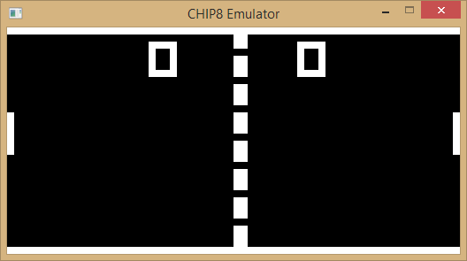

Chip8 Rust
========

A Chip8 emulator written in Rust.

### Working Chip8 Programs

* Pong [Paul Vervalin, 1990]
* IBM Logo
* SQRT Test [Sergey Naydenov, 2010]
* Random Number Test [Matthew Mikolay, 2010]
* Delay Timer Test [Matthew Mikolay, 2010]
* Chip8 emulator Logo [Garstyciuks]
* Minimal game [Revival Studios, 2007]
* Sierpinski [Sergey Naydenov, 2010]

### Issues

* Major bugs in many games
* Flickering issues
* Bugs with drawing code
